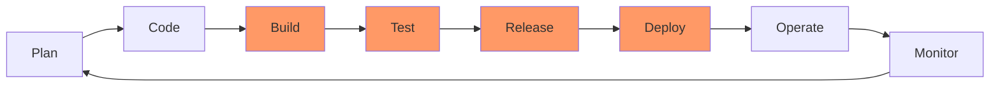
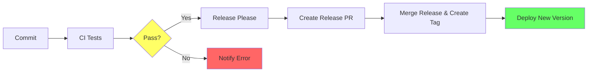

# DevOps Desmistificado
## Construindo sua Pipeline do Zero

<div class="pt-12">
  <span @click="$slidev.nav.next" class="px-2 py-1 rounded cursor-pointer" hover="bg-white bg-opacity-10">
    Minicurso SCTI 2025 <carbon:arrow-right class="inline"/>
  </span>
</div>

<div class="abs-br m-6 text-sm opacity-50">
  por Zoey de Souza Pessanha
</div>

---
layout: intro
---

# Agenda do Minicurso

### Fluxo prático do workshop
1. **Conceitos fundamentais** - Terminal, Docker, CI/CD, GitHub
2. **Fork e teste local** - Clonar projeto base e rodar localmente
3. **Deploy produção** - Instalar Railway e fazer primeiro deploy
4. **Quebrar pipeline** - Fazer alteração que falha no CI
5. **Corrigir pipeline** - Resolver problema e ver CI verde
6. **Release automático** - Merge do PR de release-please
7. **Validar produção** - Verificar nova versão no ar

<v-click>

### Nossa Meta
Ver uma aplicação indo do código local até produção de forma automatizada!

</v-click>

---
layout: center
---

# O que é DevOps?

<v-click>

## Dev + Ops = DevOps

Desenvolvimento + Operações

</v-click>

<v-click>

### Antigamente
**Devs**: "Funciona na minha máquina!"  
**Ops**: "Não vou colocar isso em produção!"

</v-click>

<v-click>

### Hoje
**Todos**: "Vamos automatizar e padronizar tudo!"

</v-click>

---

# O Ciclo DevOps



<v-click>

### Nosso foco hoje: Build → Test → Release → Deploy

A parte mais prática e visível do DevOps!

</v-click>

---

# Por que DevOps importa?

<div class="grid grid-cols-2 gap-8">
<div>

### Sem DevOps
- Deploy manual (sexta às 23h)
- "Funciona na minha máquina"
- Bugs descobertos em produção
- Medo de fazer mudanças
- Deploys demoram horas/dias

</div>
<div>

### Com DevOps
- Deploy automatizado
- Ambiente padronizado
- Bugs pegos antes de produção
- Confiança para inovar
- Deploy em minutos

</div>
</div>

<v-click>

### Empresas que usam
Netflix: 1000+ deploys por dia  
Amazon: Deploy a cada 11.7 segundos

</v-click>

---
layout: section
---

# Parte 1: Fundamentos
## Terminal, Git e Docker

---

# Terminal: Sua Nova Casa

### Comandos essenciais que usaremos hoje

```bash
# Navegação
pwd                     # Onde estou?
ls -la                  # O que tem aqui?
cd projeto              # Entrar na pasta
cd ..                   # Voltar uma pasta

# Arquivos
mkdir devops-lab        # Criar pasta
touch README.md         # Criar arquivo
cat arquivo.txt         # Ver conteúdo
nano arquivo.txt        # Editar arquivo

# Processos
ps aux                  # Ver processos
kill -9 PID            # Matar processo
ctrl+c                 # Parar comando atual
```

---

# Git: Controle de Versão

### Fluxo básico que repetiremos várias vezes

```bash
# Configuração inicial (só uma vez)
git config --global user.name "Seu Nome"
git config --global user.email "seu@email.com"

# Fluxo diário
git clone https://github.com/usuario/repo.git
cd repo
git add .
git commit -m "feat: adiciona health check"
git push origin main

# Ver o que está acontecendo
git status
git log --oneline
```

<v-click>

### Convenção de commits
- `feat:` nova funcionalidade
- `fix:` correção de bug
- `docs:` documentação
- `chore:` tarefas gerais

</v-click>

---

# Docker: Containers Explicados

<div class="grid grid-cols-2 gap-4">
<div>

### Container ≠ VM

**Máquina Virtual**
- Sistema operacional completo
- Pesada (GBs)
- Demora pra iniciar
- Isolamento total

**Container**
- Apenas o necessário
- Leve (MBs)
- Inicia em segundos
- Compartilha kernel

</div>
<div>

### Analogia

**VM** = Casa completa
- Tem tudo próprio
- Cozinha, banheiro, quarto

**Container** = Quarto de hotel
- Só o essencial
- Compartilha infraestrutura

</div>
</div>

---

# Docker: Conceitos Chave

```dockerfile
# Dockerfile = Receita do bolo
FROM alpine:latest # <repositorio>/<imagem>:<versao>
COPY . ./ # Copia arquivos locais para o container
RUN ls -a # Executa comandos dentro do container
CMD ["echo", "deu bom"] # Entrada do 
```

<v-click>

### Comandos essenciais

```bash
docker build -t meuapp .           # Construir imagem
docker run meuapp                  # Rodar container
docker ps                          # Ver containers rodando
docker logs container_id           # Ver logs
docker stop container_id           # Parar container
```

</v-click>

---
layout: section
---

# Parte 2: Nossa Aplicação
## StatusAPI - Health Check Service

---

# StatusAPI

### Uma API simples com 3 endpoints

```elixir
GET /         → {"message": "Serviço rodando normalmente, vai um cafézin?!?"}
GET /health   → {"status": "saudável", "timestamp_unix": "..."}
GET /info     → {"version": "0.1.0", "hostname": "...", "participants": {...}}
```

<v-click>

### Por que essa aplicação?

- **Simples**: Entende em 30 segundos
- **Útil**: Todo sistema precisa de health check
- **Visual**: Fácil ver funcionando
- **Educativa**: Mostra conceitos reais

</v-click>

<v-click>

### Vamos usar ela para

1. Rodar local
2. Dockerizar
3. Criar testes
4. Automatizar deploy

</v-click>

---

# Estrutura do Projeto

```bash
scti-2025-status-api/
├── lib/
│   └── service.ex       # Código da aplicação
├── test/
│   └── service_test.exs # Testes
├── mix.exs              # Configuração do projeto
├── Makefile             # Comandos automatizados
```

<v-click>

### Cada arquivo tem um propósito

- **service.ex**: Lógica da aplicação
- **mix.exs**: Configuração e dependências
- **Makefile**: Simplifica comandos

</v-click>

---
layout: section
---

# Parte 3: CI/CD
## Integração e Entrega Contínua

---

# O que é CI/CD?

<div class="grid grid-cols-2 gap-8">
<div>

### CI - Integração Contínua

Sempre que alguém faz push:
1. Baixa o código
2. Instala dependências
3. Roda testes
4. Verifica qualidade
5. Avisa se quebrou

**Objetivo**: Pegar bugs cedo

</div>
<div>

### CD - Entrega Contínua

Se os testes passaram:
1. Constrói a aplicação
2. Cria imagem Docker
3. Faz deploy
4. Verifica se está saudável

**Objetivo**: Deploy sem medo

</div>
</div>

<v-click>

### A mágica: Tudo isso acontece automaticamente com Railway e release-please!

</v-click>

---

# GitHub Actions: Nossa Ferramenta

### Pipeline em YAML

```yaml {all|1-6|8-10|12-21}
name: CI Pipeline

on:
  push:
    branches: [main]
  pull_request:

jobs:
  test:
    runs-on: ubuntu-latest
    
    steps:
    - uses: actions/checkout@v3
    
    - name: Setup Elixir
      uses: erlef/setup-beam@v1
      with:
        elixir-version: 1.16.0
    
    - name: Run tests
      run: mix test
```

---

# Pipeline Completa



<v-click>

### Fluxo real do workshop

- **CI**: Testa formatação e executa testes Elixir
- **Deploy**: Railway detecta push e faz deploy automático
- **Release**: Release-please cria PRs de versão automaticamente
- **Versionamento**: Merge do PR gera tag e nova versão

</v-click>

---
layout: section
---

# Parte 4: Hands On!
## Vamos construir juntos

---

# Exercício 1: Setup Inicial

### Objetivo: Preparar ambiente

1. Instalar CLI do github https://github.com/cli/cli/releases/tag/v2.78.0

```bash
# 2. No terminal, clonar o repositório
gh repo fork zoedsoupe/scti-2025-status-api
```

<v-click>

### Checkpoint
- Repositório forkado  
- Código clonado localmente  
- Estrutura explorada

</v-click>

---

# Exercício 2: Rodar Local

### Objetivo: Ver aplicação funcionando

1. Vamos montar o Dockerfile!

```dockerfile
FROM elixir:1.18-otp-28

ARG PORT=4000

# Configura ambiente para produção
ENV MIX_ENV=prod PORT=$PORT

WORKDIR /app

# Instala repositórios de dependêsncias
RUN mix local.hex --force && mix local.rebar --force

# Copia arquivo de entrada do projeto
COPY mix.exs mix.lock ./

# Instala depêndencias
RUN mix deps.get
RUN mix deps.compile

# Compila o projeto (vai ser interpretado)
RUN mix compile

# Copia código fonte
COPY .formatter.exs .
COPY lib ./lib

EXPOSE $PORT

CMD ["mix", "run", "--no-halt"]
```

---

2. Agora vamos rodar localmente:

```bash
# 1. Rodar aplicação
make docker-run

# 2. Em outro terminal, testar
make curl
make curl route="health"
make curl route"info"

# 3. Modificar 
# Editar lib/service.ex, mudar array `@participants`
# Parar (Ctrl+C) e rodar novamente (make docker-run)
```

<v-click>

### O que aprendemos
- Como rodar uma aplicação Elixir com Docker
- Como testar com curl
- Ciclo de desenvolvimento local

</v-click>

---

# Exercício 3: Deploy Railway

### Objetivo: Colocar aplicação em produção

```bash
# 1. Acessar Railway
# https://railway.app
# Login com GitHub

# 2. Criar novo projeto
# "Deploy from GitHub repo"
# Selecionar seu fork: scti-2025-status-api

# 3. Aguardar primeiro deploy
# Railway detecta Dockerfile automaticamente
# Build e deploy acontecem sozinhos

# 4. Gerar URL pública
# Settings > Generate Domain
# Copiar URL gerada
```

<v-click>

### Testar produção
```bash
curl https://SEU-APP.railway.app/
curl https://SEU-APP.railway.app/health
curl https://SEU-APP.railway.app/info    # Versão 0.1.0
```

</v-click>

---

# Exercício 4: Quebrar o CI

### Objetivo: Ver pipeline falhando

```bash
# 1. Fazer alteração que quebra testes
# Editar lib/service.ex
# Mudar mensagem da rota "/" 

# 2. Commit e push
git add .
git commit -m "feat: nova mensagem de boas vindas"
git push origin main

# 3. Ver GitHub Actions falhando
# GitHub > Actions > Ver workflow vermelho
# CI falha porque testes esperam mensagem original
```

<v-click>

### Pipeline atual
- **CI**: Testa formatação e executa testes
- **Build**: Cria imagem Docker
- **Deploy**: Railway faz deploy automático quando CI passa

</v-click>

---

# Exercício 5: Corrigir CI

### Objetivo: Deixar pipeline verde novamente

```bash
# 1. Atualizar testes para nova mensagem
# Editar test/service_test.exs
# Alterar assertion para a nova mensagem

# 2. Commit da correção
git add .
git commit -m "test: atualiza teste para nova mensagem"
git push origin main

# 3. Ver CI passando
# GitHub > Actions > Ver workflow verde
# Railway fará deploy automático
```

<v-click>

### Release automático
- **Release-please** criará PR automaticamente
- PR contém changelog e bump de versão
- Merge do PR = nova tag = deploy com nova versão

</v-click>

---
layout: section
---

# Resumo do Fluxo Completo
## Do local à produção

---

# Exercício 6: Release e Deploy Final

### Objetivo: Ver versionamento automático

```bash
# 1. Aguardar release-please criar PR
# GitHub > Pull Requests > "chore(main): release X.X.X"

# 2. Fazer merge do release PR
# Merge pull request

# 3. Aguardar deploy automático
# Railway fará novo deploy com a tag criada

# 4. Testar nova versão
curl https://SEU-APP.railway.app/info
# Versão deve ter mudado de 0.1.0 para 0.2.0
```

<v-click>

### Critérios de sucesso

- CI verde após correção  
- Release PR criado automaticamente  
- Nova versão deployada  
- Aplicação respondendo com versão atualizada

</v-click>

---

# O que vocês conseguiram hoje

### Jornada completa: Local → Produção

1. **Entenderam conceitos** - Terminal, Docker, CI/CD, GitHub
2. **Rodaram localmente** - Aplicação Elixir com Docker
3. **Deployaram produção** - Railway detectou e buildou automaticamente
4. **Quebraram pipeline** - Viram CI falhar quando testes não passam
5. **Corrigiram código** - Ajustaram testes e viram CI verde
6. **Release automático** - Merge do PR gerou nova versão
7. **Validaram produção** - Nova versão rodando automaticamente

<v-click>

### Isso é DevOps na prática!
**Automação** que permite **confiança** para fazer mudanças frequentes

</v-click>

---
layout: two-cols-header
---

# Ferramentas que Usamos

::left::

### Core do workshop
- **GitHub**: Versionamento e CI/CD
- **Railway**: Deploy e hospedagem
- **Docker**: Containerização
- **Elixir**: Linguagem da aplicação
- **release-please**: Versionamento automático

::right::

### Próximos passos
- Monitoring (Railway tem métricas built-in)
- Database (PostgreSQL no Railway)
- Custom domains
- Environment variables
- Multiple environments (staging/prod)

### Recursos
- [Railway Docs](https://docs.railway.com)
- [GitHub Actions](https://docs.github.com/actions)
- [Release Please](https://github.com/googleapis/release-please)

---
layout: center
---

# Parabéns!

## Vocês construíram uma pipeline DevOps completa!

<div class="mt-8">

### O que vocês aprenderam
- Docker e containers
- CI/CD com GitHub Actions
- Testes automatizados
- Deploy automatizado
- Health checks

</div>

<v-click>

### Lembrem-se
DevOps não é sobre ferramentas, é sobre **cultura** e **automação**!

</v-click>

---
layout: center
---

# Dúvidas?

### Vamos debugar juntos!

---
layout: end
---

# Obrigada!

### Contatos
- GitHub: [@zoedsoupe](https://github.com/zoedsoupe)
- Email: zoey@dashbit.co

<v-click>

### Não esqueçam

"A melhor hora para automatizar era ontem.  
A segunda melhor hora é **agora**!"

</v-click>
