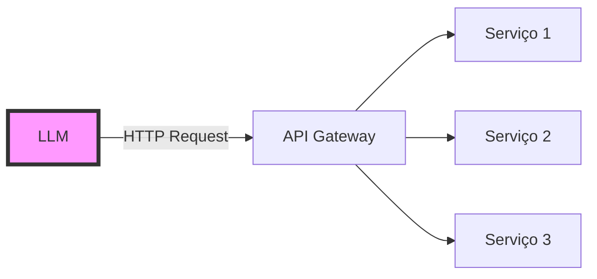
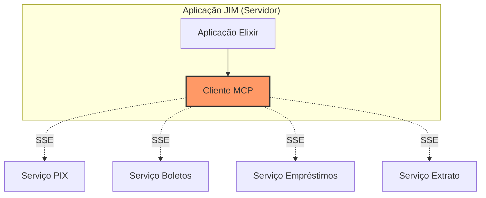

# Erlang, MCP e Kubernetes
## Lições de um Sistema Distribuído em Produção

<div class="pt-12">
  <span @click="$slidev.nav.next" class="px-2 py-1 rounded cursor-pointer" hover="bg-white bg-opacity-10">
    por Zoey de Souza Pessanha <carbon:arrow-right class="inline"/>
  </span>
</div>

<div class="abs-br m-6 flex gap-2">
  <a href="https://github.com/zoedsoupe" target="_blank" alt="GitHub" title="GitHub"
    class="text-xl slidev-icon-btn opacity-50 !border-none !hover:text-white">
    <carbon-logo-github />
  </a>
</div>

---
layout: intro
---

# Quem sou eu? 🏳️‍⚧️

<div class="grid grid-cols-2 gap-4">
<div>

- Senior Software Engineer @ Dashbit
- Foco em fintechs e sistemas distribuidos
- Co-host do **Elixir em Foco**
- Mantenedora de bibliotecas de **codigo aberto**
- Entusiasta de **programacao funcional**
- Otima cozinheira e emo/gotica no tempo livre

</div>
<div>

### Jornada Profissional Recente
- Ex-Nubanker
- Ex-InfinitePay/CloudWalk (jim.com) 
- PEA Pescarte
- Projeto Tidewave.ai

</div>
</div>

---
layout: center
---

# Antes de começar...
## Vamos criar nosso dicionário!

<v-click>

### Porque toda boa história precisa de um glossário

</v-click>

<!--
Aqui vou explicar termos técnicos de forma que QUALQUER UM entenda
-->

---

# Dicionário da Aventura

<div class="grid grid-cols-2 gap-6">
<div>

## Termos Básicos
- **LLM**: Um cérebro artificial que entende (+-) e gera texto
- **API**: Como uma tomada USB - conecta coisas diferentes
- **Processo**: Um trabalhador independente fazendo uma tarefa
- **Cluster**: Vários computadores trabalhando como um time

</div>
<div>

## Termos Avançados
- **BEAM**: A máquina virtual do Erlang (casa onde Elixir mora)
- **MCP**: Protocolo para LLMs conversarem com o mundo
- **CRDT**: Consistencia eventual, uma hora vai dar certo!
- **Delta CRDT**: Mágica matemática para sincronizar dados
- **Pod**: Container rodando no Kubernetes (vulgo maquina)
- **SSE**: Eventos HTTP enviados pelo servidor (assincrono)

</div>
</div>

---
layout: image-right
image: /whatsapp-architecture.png
backgroundSize: 28em 65%
---

# A História Começa com WhatsApp

<v-clicks>

- **900 milhões** de usuários
- Apenas **50 engenheiros**
- Linguagem: **Erlang**

### Como isso é possível?

*"É como ter uma cidade inteira funcionando com apenas 50 pessoas na prefeitura"*

</v-clicks>

---
layout: center
---

# Capítulo 1: O Problema
## "Precisamos conversar com IA"

<div class="mt-8">

Imagine que você tem um assistente super "inteligente" (LLM)...

<v-click>

...mas ele vive numa **bolha**!

</v-click>

<v-click>

Não consegue:
- Executar ações no mundo real  
- Lembrar de conversas antigas

</v-click>
</div>

---

# A Solução Antiga: APIs REST



<v-clicks>

### Problemas:
- Cada serviço = protocolo diferente
- Autenticação complexa
- Sem padronização
- Prompt de sistema infinito
- **Replicação de regras de negócio** 😱

</v-clicks>

---
layout: two-cols
---

# Solução: Model Context Protocol (MCP)

<v-click>

## O que é MCP?

*"É como se criássemos um **USB-C** para IA"*

</v-click>

<v-click>

### Antes do USB-C:
- Cabo para iPhone
- Cabo para Android  
- Cabo para notebook
- Cabo para fone...

</v-click>

::right::

<v-click>

### Com USB-C (MCP):
- **Um protocolo**
- **Uma conexão**
- **Funciona como uma extensao das APIs HTTP atuais**

```json
{
  "jsonrpc": "2.0",
  "method": "tools/call",
  "params": {
    "name": "fazer_pix",
    "arguments": {
      "valor": 100,
      "destino": "zoey@email.com"
    }
  }
}
```

</v-click>

---

# Como MCP Funciona?

<div class="grid grid-cols-3 gap-4">

<div>

### 1. Resources
*Arquivos que podem ser acessados*

```json
{
  "uri": "database://users",
  "name": "Usuários",
  "mimeType": "application/json"
}
```

</div>

<div>

### 2. Tools
*"Ações que pode fazer"*

```json
{
  "name": "pagar_boleto",
  "description": "Paga um boleto",
  "inputSchema": {...}
}
```

</div>

<div>

### 3. Prompts
*"Templates para mensagens"*

```json
{
  "name": "resumo_financeiro",
  "description": "Gera resumo",
  "arguments": [...]
}
```

</div>

</div>

---
layout: center
---

# Plot Twist #1
## "MCP é stateful (dos dois lados!)"

<v-click>

No HTTP tradicional:
- Cada requisição é **independente**  
- Cliente não guarda contexto
- Servidor também não

</v-click>

<v-click>

No **MCP**:
- **Cliente** mantém conexões abertas com estado  
- **Servidor** também mantém **estado por sessão**  
- Tudo sobrevive por toda a conversa com o LLM

</v-click>

<v-click>

*"É como uma videochamada: você não liga e desliga a cada frase. Ambos lados estão **sincronizados em tempo real**."*

</v-click>

---

# Capítulo 2: O Desafio na CloudWalk

<div class="text-2xl font-bold mb-8">
JIM.com - Assistente Financeiro com IA
</div>

<v-clicks>

### Contexto:
- **400 mil** usuários ativos diários
- **3 máquinas** apenas (Elixir é bruxaria!)
- Múltiplos times/serviços internos

### O Problema Original:
```elixir
# Nosso código ANTES do MCP
def processar_comando(%{tipo: "pix", valor: valor}) do
  # Reimplementando regra de negócio do time de pagamentos!!!!
  validar_limite_pix(valor)
  verificar_horario_pix()
  calcular_taxa_pix()
end
# ... mais 600 linhas de código duplicado
```

</v-clicks>

---

# A Arquitetura Inicial com MCP



<v-click>

### Parecia perfeito!

Cada time expõe suas capacidades via MCP...

</v-click>

<v-click>

### Mas...

</v-click>

<v-click>

A vida nao e um morango ;-;

</v-click>

---
layout: center
---

# Plot Twist #2
## "A infraestrutura tem limites"

<div class="text-6xl my-8">
3KB
</div>

<v-click>

### Buffer máximo entre serviços

*Imagina tentar transferir um arquivo de 2gb pra um HD de so 1gb*

</v-click>

---

# O Problema dos 3KB

```json {all|1-10|11-13}
{
  "jsonrpc": "2.0",
  "method": "tools/call",
  "params": {
    "name": "gerar_relatorio_completo",
    "arguments": {
      "periodo": "ultimo_ano",
      "incluir_graficos": true,
      "dados_detalhados": {
        // ... mais 2.5KB de dados ...
      }
    }
  }
}
// 💥 TRUNCADO EM 3KB - Mensagem corrompida!
```

<v-click>

### Solução: 
Depois de MUITO debug e tickets de suporte... aumentamos o buffer!

</v-click>

<v-click>

### Mas aí veio o problema REAL...

</v-click>

---
layout: center
---

# Plot Twist #3
## "Load balancer + estado ≠ amigos"

<div class="mt-8 text-xl">

Usuário: *"Oi JIM, paga meu boleto"*

</div>

<v-clicks>

- **Load Balancer:** "Hmm... vou mandar para a Máquina 1!"
- Próxima requisição? "Agora para a Máquina 2!"
- Terceira? "Agora para a Máquina 3!"

</v-clicks>

<v-click>

Resultado:
- Cada máquina cria **sua própria sessão MCP** para o mesmo usuário  
- Estado do cliente **duplicado em 3 nós**  
- Respostas inconsistentes, recursos desperdiçados  

</v-click>

<v-click>

*"Stateful + round-robin = caos invisível"*

</v-click>

---

# O Caos do Estado Distribuído

<div class="grid grid-cols-2 gap-8">
<div>

### Requisição 1 (Máquina A)
```elixir
# Estado: conectado, autenticado
MCP.call_tool("pagar_boleto", %{
  codigo: "123..."
})
# ✅ Funciona!
```

</div>
<div>

### Requisição 2 (Máquina B)
```elixir
# Estado: não conectado ainda
MCP.call_tool("pagar_boleto", %{
  codigo: "456..."
})
# ❌ Erro: não autenticado
```

</div>
</div>

<v-click>

### Resultado:
- Respostas inconsistentes
- Conexões duplicadas
- Servidores sobrecarregados
- **Usuários confusos**

</v-click>

---

# Solução 1: Processo Global

```elixir {all|1-8|9-14}
# Apenas UMA instância no cluster todo
defmodule GlobalMCPClient do
  use GenServer
  
  def start_link(_) do
    GenServer.start_link(__MODULE__, [], name: {:global, __MODULE__})
  end
end

# Agora todas as máquinas usam o mesmo processo
def handle_request(user_request) do
  GenServer.call({:global, GlobalMCPClient}, {:process, user_request})
end

# Sem duplicação! Uma conexão só!
```

<v-click>

### Parece perfeito né?

</v-click>

<v-click>

### ERRADO! 😈

</v-click>

---
layout: center
---

# Plot Twist #4
## "Single Point of Failure"

<div class="text-4xl my-8">

*"Colocar todos os ovos na mesma cesta"*

</div>

<v-clicks>

Processo global morre = **TUDO** morre

400k usuários passando por **1 processo**

Gargalo monumental!!!

</v-clicks>

---

# Erlang/OTP Magic

## O que é BEAM?

<v-clicks>

*"Imagine uma comunidade onde cada pessoa mora em uma casa com sistema anti-bombas e se comunicam por mensagens"*

- Cada processo é **isolado** (e leve! 1kb no max)
- Se um morre, outros **continuam**
- Podem conversar por **mensagens**
- **Supervisores** ressuscitam os mortos

### Números impressionantes:
- WhatsApp: 2 milhões de conexões por servidor
- Discord: 5 milhões de usuários simultâneos
- **JIM**: 400k processos simultâneos

</v-clicks>

---

# A Dança dos Processos

```elixir {all|1-11|12-18|19-24}
# Supervisor cuida de todos
defmodule JIM.Supervisor do
  use Supervisor
  
  def init(_) do
    children = [
      {Registry, keys: :unique, name: JIM.Registry},
      {DynamicSupervisor, name: JIM.UserSupervisor}
    ]
  end
end

# Processo por usuário
defmodule JIM.UserProcess do
  def start_for_user(user_id) do
    DynamicSupervisor.start_child(JIM.UserSupervisor, {__MODULE__, user_id})
  end
end

# 400k processos rodando
# Cada um com seu estado
# Cada um com suas conexões
# Isolados e supervisionados
```

<!--
**Visual para Anthony**: Árvore de supervisão estilo organograma com milhares de pequenos pontos
-->

---
layout: center
---

# Plot Twist #5
## "Kubernetes vs BEAM"

<div class="text-2xl mt-8">

*"É como se dois maestros tentassem reger a mesma orquestra"*

</div>

<v-clicks>

**Kubernetes**: "Eu controlo os containers!"

**BEAM**: "Eu controlo os processos e as maquinas!"

**Kubernetes**: "Vou fazer deploy canário!"

**BEAM**: "Peraí, meu cluster! :("

</v-clicks>

---

# O Problema do Canary Release

```yaml {all|1-7|8-13}
# Kubernetes fazendo deploy gradual
apiVersion: apps/v1
kind: Deployment
spec:
  replicas: 3
  strategy:
    type: RollingUpdate
    
# Enquanto isso no cluster Erlang...
# Pod A (v1.0): "Oi galera!"
# Pod B (v1.0): "Oi!? cade meu estado?"
# Pod C (v1.1): "Oi... quem são vocês?"
```

<v-click>

### Resultado:
- Cluster se **particiona**
- Estado **duplicado**
- Conexões **perdidas**
- **Caos total**

</v-click>

---

# Enter: Delta CRDTs

## O que são CRDTs?

<v-clicks>

*"Como Google Docs funciona com múltiplas pessoas editando ao mesmo tempo"*

### Propriedades Mágicas:
- **Comutativo**: A + B = B + A
- **Associativo**: (A + B) + C = A + (B + C)  
- **Idempotente**: A + A = A

### Na prática:
Não importa a ordem, sempre converge pro mesmo estado!

</v-clicks>

---

# Delta CRDTs em Ação

<div class="grid grid-cols-2 gap-4">
<div>

### CRDT Normal
```elixir
# Envia estado COMPLETO
%{
  users: %{
    "user1" => %{...},  # 10KB
    "user2" => %{...},  # 10KB
    "user3" => %{...},  # 10KB
    # ... 400k usuários
  }
}
# 💀 4GB por sincronização!
```

</div>
<div>

### Delta CRDT
```elixir
# Envia apenas MUDANÇAS
%{
  delta: %{
    added: ["user99999"],
    removed: [],
    updated: %{
      "user123" => %{last_seen: now()}
    }
  }
}
# 😊 ~100 bytes!
```

</div>
</div>

---

# A Solução Final: Quarentena

```elixir {all|3-7|9-15|17-22}
# Novo pod entrando no cluster
defmodule JIM.ClusterQuarantine do
  def handle_new_node(node) do
    # Fase 1: Observação
    put_in_quarantine(node)
    monitor_health(node, timeout: :timer.seconds(30))
  end
  
  # Fase 2: Teste
  def health_check(node) do
    case test_mcp_connection(node) do
      :ok -> promote_to_cluster(node)
      :error -> keep_in_quarantine(node)
    end
  end
  
  # Fase 3: Integração
  def promote_to_cluster(node) do
    :libcluster.join(node)
    :horde.sync_state(node)
    distribute_processes(node)
  end
end
```
---

# Sharding por Usuário

```elixir {all|3-7|8-14}
# Cada usuário tem seu processo dedicado
defmodule JIM.UserShard do
  def get_process_for_user(user_id) do
    # Hash consistente para sempre ir pro mesmo nó
    node = :erlang.phash2(user_id, length(Node.list()))
    {:ok, pid} = start_or_get_process(user_id, node)
  end
  
  def start_or_get_process(user_id, node) do
    case Registry.lookup(JIM.Registry, user_id) do
      [{pid, _}] -> {:ok, pid}
      [] -> DynamicSupervisor.start_child(...)
    end
  end
end
```

<v-click>

### Resultado:
- **400k processos** distribuídos
- Cada usuário sempre no **mesmo nó**
- Estado **consistente**
- Falhas **isoladas**

</v-click>

---
layout: center
---

# Capítulo Final
## "Do caos nasceu uma biblioteca"

<v-click>

Durante esses desafios na CloudWalk...  
Criei o **Hermes-MCP**, o **primeiro SDK de MCP para Elixir**!

</v-click>

<v-click>

- Começou como solução interna para o JIM.com
- Open-source para a comunidade
- Evoluiu com feedback real de produção

</v-click>

<v-click>

Agora, na **Dashbit**, ele virou **Anubis-MCP**:  
um projeto **maduro e aberto para todos**.

</v-click>

---

# SDK MCP Elixir

```elixir {all|1-8|10-18|19-26}
# Cliente MCP em Elixir
defmodule MyApp.MCPClient do
  use Anubis.Client,
    name: "MyApp",
    version: "1.0.0",
    transport: :http,
    capabilities: [:tools, :resources]
end

# Servidor MCP em Elixir
defmodule MyApp.MCPServer do
  use Anubis.Server
  
  def handle_tool_call("fazer_pix", params, state) do
    # Sua lógica aqui
    {:reply, result, state}
  end
end

# Uso simples
{:ok, tools} = MyApp.MCPClient.list_tools()
{:ok, result} = MyApp.MCPClient.call_tool("fazer_pix", %{valor: 100, destino: "alguem@email.com"})

# Tudo supervisionado, tolerante a falhas! ✨
```

---

# Lições Aprendidas

<div class="grid grid-cols-2 gap-8">
<div>

## Técnicas
1. **MCP** é revolucionário para IA
2. **BEAM** aguenta MUITA porrada
3. **Delta CRDTs** > replicação comum
4. **Sharding** resolve grande parte dos problemas de escala
5. **Quarentena** salva deploys

</div>
<div>

## Humanas
1. **Simplicidade** > Complexidade
2. Debug de **infra** é um inferno
3. **Documentação** é crucial
4. **Open source** é o caminho
5. **Reviravoltas** acontecem!

</div>
</div>

---
layout: center
---

# Pensamento Final

<div class="text-2xl mt-8">

*"Construímos uma solução para 400k usuários com 3 máquinas e poucos engenheiros"*

</div>

<v-clicks>

Não porque somos **gênios**...

Mas porque escolhemos as **ferramentas certas**

E aprendemos com **cada erro**

</v-clicks>

<v-click>

### E o mais importante:

## Compartilhamos o conhecimento!

</v-click>

---
layout: center
---

# Obrigada! 🖤

<div class="text-xl mt-8">

## Vamos construir o futuro juntes?

</div>

<div class="my-4 mx-16">
  
</div>

<v-click>

### Perguntas? 
*Prometo que não mordo... (depende)*

</v-click>

---
layout: center
---

# Q&A Time!

---
layout: center
---

# Bonus: Live Coding?

<v-click>

### Se sobrar tempo...
Vamos ver Anubis-MCP funcionando ao vivo!

</v-click>
