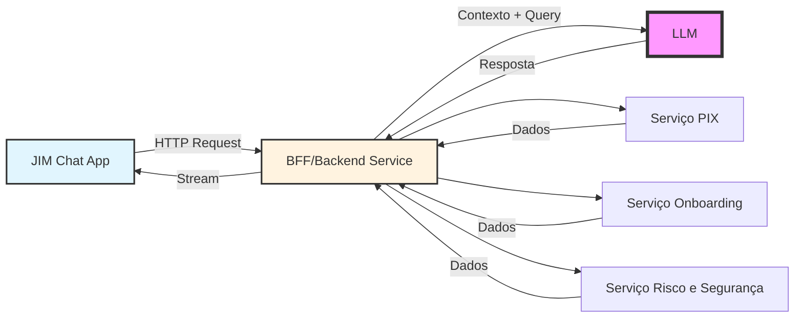
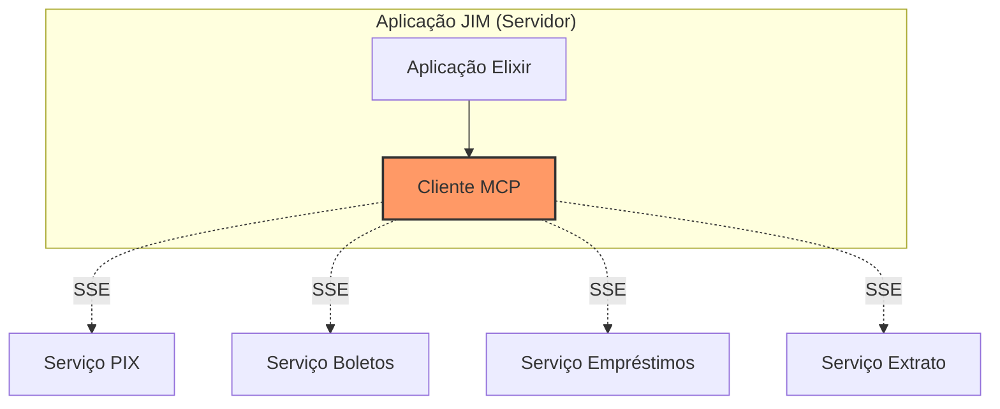

# Erlang, MCP e Kubernetes
## Lições de um Sistema Distribuído em Produção

<div class="pt-12">
  <span @click="$slidev.nav.next" class="px-2 py-1 rounded cursor-pointer" hover="bg-white bg-opacity-10">
    por Zoey de Souza Pessanha <carbon:arrow-right class="inline"/>
  </span>
</div>

---
layout: intro
---

# Quem sou eu? 🏳️‍⚧️

<div class="grid grid-cols-2 gap-4">
<div>

- Desenvolvedora senior @ Dashbit
- Foco em fintechs e sistemas distribuídos de alta disponibilidade
- Co-host do **Elixir em Foco**
- Mantenedora de bibliotecas de **código aberto**
- Entusiasta de **programação funcional**
- Ótima cozinheira e emo/gótica no tempo livre

</div>
<div>

### Jornada Profissional Recente
- Nubank
- Cumbuca divisao de pagamentos
- InfinitePay/CloudWalk (jim.com) 
- PEA Pescarte

</div>
</div>

---
layout: center
---

# Antes de começar...

## Vamos criar nosso dicionário!

<v-click>

### Porque toda boa fofoca precisa de um bom contexto!

</v-click>

<!--
Vou explicar apenas os conceitos básicos no início, o resto vem conforme a história avança
-->

---

# Dicionário da Aventura - Primeira Onda

## Conceitos Básicos para Começar
*"Os ingredientes básicos da nossa receita de caos"*

<div class="grid grid-cols-2 gap-12">
<div>

### Para Humanos
- **LLM**: Um cérebro artificial que entende (+-) e gera texto
- **API**: Como uma tomada USB - conecta coisas diferentes
- **Processo**: Um trabalhador independente fazendo uma tarefa

</div>
<div>

### Para Máquinas
- **Cluster**: Vários computadores trabalhando como um time
- **Balanceador de Carga**: Porteiro que decide qual máquina recebe cada visitante

</div>
</div>

<v-click>

### Não se preocupe!
*Os termos mais técnicos vão aparecer conforme a história avança... com contexto!*

</v-click>

---
layout: center
---

# Exemplos de Sucesso com Erlang/BEAM

## WhatsApp
- **900 milhões** de usuários com apenas **50 engenheiros**
- **2 milhões** de conexões por servidor

## Discord
- **5 milhões** de usuários simultâneos
- Voz em tempo real sem lags

## Ericsson
- **99,9999%** de uptime em telecom
- Onde Erlang nasceu nos anos 80

---
layout: center
---

# A Base de Tudo: BEAM/Erlang/Elixir

<v-click>

### Dicionário - Segunda Onda!
- **BEAM**: Máquina virtual onde Erlang e Elixir rodam
- **Erlang**: Linguagem criada pela Ericsson nos anos 80 para telecomunicações
- **Elixir**: Linguagem moderna (2011) que roda na BEAM com sintaxe mais amigável
- **OTP**: Framework para construir sistemas distribuídos (vem com Erlang)

</v-click>

<v-click>

### No JIM usamos Elixir desde o dia 0!
*Spoiler: foi a melhor decisão técnica que tomamos*

</v-click>

---

# Por que BEAM é Especial?

### Modelo de Atores
*"Imagine milhões de mini-programas independentes conversando por WhatsApp"*

- **Processos ultra-leves**: ~2KB de memória cada (não são threads do OS!)
- **Isolamento total**: Um processo crashando não afeta outros
- **Comunicação assíncrona**: Trocam mensagens, nunca compartilham memória
- **Supervisão hierárquica**: Processos "pais" cuidam dos "filhos"

---

### Por que isso é revolucionário?

| Linguagem Tradicional | BEAM/Elixir |
|----------------------|-------------|
| Thread = ~2MB memória | Processo = ~2KB memória |
| Crash = aplicação morre | Crash = supervisor reinicia |
| Compartilham memória | Mensagens isoladas |
| Difícil distribuir | Distribuído nativamente |

### No JIM isso significa:
- **400k+ usuarios** em 3 máquinas = tranquilo (Elixir e bruxaria)
- Cada usuário tem seu próprio processo isolado
- Se um crashar, outros 399.999 continuam funcionando

---
layout: two-cols-header
---

<style>
h1 { @apply text-center; }
div.col-left { @apply mr-4; }
div.col-right { @apply ml-4; }
</style>

# Código Elixir: Como é na Prática?

```elixir {all|1-13|14-24}
# Supervisor que gerencia todos os processos
defmodule JIM.Supervisor do
  use Supervisor
  
  def init(_) do
    children = [
      {Registry, keys: :unique, name: JIM.Registry},
      {DynamicSupervisor, name: JIM.UserSupervisor},
      # Pode ter centenas de milhares de filhos!
    ]
    Supervisor.init(children, strategy: :one_for_one)
  end
end

# Cada usuário tem seu processo
defmodule JIM.UserProcess do
  use GenServer
  
  def handle_cast({:mensagem, texto}, state) do
    # Processa mensagem do usuário
    # Totalmente isolado dos outros!
    {:noreply, novo_estado}
  end
end
```

---
layout: center
---

# Capítulo 1: O Problema

<div class="mt-8 text-center">

## "Precisamos conversar com IA"

Imagine que você tem um assistente super "inteligente" (LLM)...

<v-click>

...mas ele vive numa **bolha**!

</v-click>

<v-click>

Não consegue:
1. Executar ações no mundo real  
1. Lembrar de conversas antigas

</v-click>
</div>

---

# A Solução Antiga: APIs HTTP



<v-clicks>

### Problemas:
- Cada serviço = protocolo diferente (gRPC, GraphQL, REST)
- Autenticação complexa (JWT, SSO)
- Sem padronização nas trocas de mensagens
- Prompt de sistema infinito (temos que dar todo o contexto pra LLM)
- **Replicação de regras de negócio** 😱

</v-clicks>

---
layout: center
---

# Solução: Model Context Protocol (MCP)

<v-click>

### Dicionário - Terceira Onda!
- **MCP**: Protocolo para LLMs conversarem com o mundo
- **SSE**: Eventos HTTP enviados pelo servidor (assíncrono)
- **JSON-RPC**: "Linguagem" padrão que MCP usa para conversar

</v-click>

---
layout: two-cols-header
---

# O que é MCP?

*"É como se criássemos um **USB-C** para IA"*

::left::

### Antes do USB-C:
- Cabo para iPhone
- Cabo para Android  
- Cabo para notebook
- Cabo para fone...

::right::

### Com USB-C (MCP):
- **Protocolo padronizado**
- **Uma conexão por interacao**
- **Funciona como uma extensão das APIs HTTP atuais**

```json
{
  "jsonrpc": "2.0",
  "method": "tools/call",
  "params": {
    "name": "fazer_pix",
    "arguments": {
      "valor": 100,
      "destino": "bacen@email.com"
    }
  }
}
```

---

# MCP: Os 3 Pilares da Mágica

<div class="mb-8">

*"Imagine que o LLM é como um chef, mas que só sabe cozinhar dentro da cozinha pessoal. MCP oferece:"*

</div>

<div class="grid grid-cols-3 gap-8">

<div>

### 1. Resources
*"Ingredientes que ele pode usar"*

```json
{
  "uri": "file:///home/tomate.png",
  "name": "Tomate",
  "description": "Fruta levemente acida"
}
```

*"Oi LLM, aqui está seu tomate!"*

</div>

<div>

### 2. Tools
*"Ações que pode fazer"*

```json
{
  "name": "acender_fogao",
  "description": "Acende um fogao para cozinhar",
  "inputSchema": {
    "temperatura": "number",
    "inducao": "boolean",
    "required": ["temperatura"]
  }
}
```

*"Agora você pode usar o fogão!"*

</div>

<div>

### 3. Prompts
*"Receitas pre-prontas"*

```json
{
  "name": "molho_pomodoro",
  "description": "Receita para molho pomodoro",
  "arguments": {
    "tomate": "number",
    "azeite": "number"
  }
}
```

*"Aqui estão os pratos especiais da casa!"*

</div>

</div>

---

# MCP na Prática: O Protocolo

```json {all|1-6|7-15|16-21}
// Cliente pergunta: "Quais ferramentas você tem?"
{
  "jsonrpc": "2.0",
  "method": "tools/list",
  "id": 1
}

// Servidor responde: "Eu sei fazer PIX!"
{
  "jsonrpc": "2.0",
  "result": {
    "tools": [{"name": "fazer_pix", ...}]
  },
  "id": 1
}

// Cliente: "Então faça um PIX de R$100!"
{
  "method": "tools/call",
  "params": {"name": "fazer_pix", "arguments": {"valor": 100}}
}
```

---
layout: center
---

# Plot Twist #1
## "MCP é stateful (dos dois lados!)"

<v-click>

No HTTP tradicional:
- Cada requisição é **independente**  
- Cliente não guarda contexto
- Servidor também não

</v-click>

<v-click>

No **MCP**:
- **Cliente** mantém conexões abertas com estado  
- **Servidor** também mantém **estado por sessão**  
- Tudo sobrevive por toda a conversa com o LLM

</v-click>

<v-click>

*"É como uma videochamada: você não liga e desliga a cada frase. Ambos lados estão **sincronizados em tempo real**."*

</v-click>

---

# Capítulo 2: O Desafio do MCP na CloudWalk

<div class="text-2xl font-bold mb-8">
JIM.com - Assistente Financeiro com IA
</div>

<v-clicks>

### Contexto:
- Múltiplos times/serviços internos
- Ponto de conexao unica tanto com app mobile quanto LLM

### O Problema Original:
```elixir
# Nosso código ANTES do MCP
def processar_comando(%{tipo: "pix", valor: valor}) do
  # Reimplementando regra de negócio do time de pagamentos!!!!
  validar_limite_pix(valor)
  verificar_horario_pix()
  calcular_taxa_pix()
end
# ... mais 600 linhas de código duplicado
```

</v-clicks>

---

# A Arquitetura Inicial com MCP

<style>
g.root { @apply mx-auto; }
</style>



<v-click>

### Parecia perfeito!

Cada time expõe suas capacidades via MCP...

</v-click>

<v-click>

### Mas...

</v-click>

<v-click>

A vida não é um morango ;-;

</v-click>

---
layout: center
---

# Plot Twist #2
## "A infraestrutura tem limites"

<div class="text-6xl my-8">
3KB
</div>

<v-click>

### Buffer máximo entre serviços

*Imagina tentar transferir um arquivo de 2gb pra um HD de só 1gb*

</v-click>

---

# O Problema dos 3KB

```json {all|1-14|15}
{
  "jsonrpc": "2.0",
  "method": "tools/call",
  "params": {
    "name": "gerar_relatorio_completo",
    "arguments": {
      "periodo": "ultimo_ano",
      "incluir_graficos": true,
      "dados_detalhados": {
        // ... mais 2.5KB de dados ...
      }
    }
  }
}
// 💥 TRUNCADO EM 3KB - Mensagem corrompida!
```

<v-click>

### Solução: 
Depois de MUITO debug e tickets de suporte... aumentamos o buffer!

</v-click>

<v-click>

### Mas aí veio o problema REAL...

</v-click>

---
layout: center
---

# Plot Twist #3
## "Load balancer + estado ≠ amigos"

<div class="mt-8 text-xl">

Usuário: *"Oi JIM, paga meu boleto"*

</div>

<v-clicks>

- **Balanceador de Carga:** "Hmm... vou mandar para a Máquina 1!"
- Próxima requisição? "Agora para a Máquina 2!"
- Terceira? "Agora para a Máquina 3!"

</v-clicks>

<v-click>

Resultado:
- Cada máquina cria **sua própria sessão MCP** para o mesmo usuário  
- Estado do cliente **duplicado em 3 nós**  
- Respostas inconsistentes, recursos desperdiçados  

</v-click>

<v-click>

*"Stateful + round-robin = caos invisível"*

</v-click>

<v-click>

### E agora?

*"Usamos Elixir, temos um canivete suico pra solucoes distribuidas!"*

</v-click>

---

# Solução 1: Processo Global

```elixir {all|1-8|9-14}
# Apenas UMA instância no cluster todo
defmodule GlobalMCPClient do
  use GenServer
  
  def start_link(_) do
    GenServer.start_link(__MODULE__, [], name: {:global, __MODULE__})
  end
end

# Agora todas as máquinas usam o mesmo processo
def handle_request(user_request) do
  GenServer.call({:global, GlobalMCPClient}, {:process, user_request})
end

# Sem duplicação! Uma conexão só!
```

<v-click>

### Parece perfeito né?

</v-click>

<v-click>

### ERRADO! 😈

</v-click>

---
layout: center
---

# Plot Twist #4
## "Single Point of Failure"

<div class="text-4xl my-8">

*"Colocar todos os ovos na mesma cesta"*

</div>

<v-clicks>

Processo global morre = **TUDO** morre

400k usuários passando por **1 processo**

Gargalo monumental futuramente!!!

</v-clicks>

---
layout: center
---

# Solucao 2: Distribuir os processos MCP

### Distribuicao
- Processo do MCP vive na maquina mais saudavel
- Caso a maquina se sobrecarregue, processo migra para outra
- Estado distribuido e replicado automaticamente

### Dicionário - Quarta Onda!
- **CRDT**: Estrutura de dados que converge automaticamente
- **Delta CRDT**: CRDT que envia apenas as mudanças
- **Consistência Eventual**: Confia! Uma hora vai dar certo

---

## CRDTs: A Mágica da Convergência

<v-clicks>

*"Imagine 3 pessoas fazendo uma lista de compras no WhatsApp ao mesmo tempo..."*

**Pessoa A**: adiciona "leite", remove "pão"  
**Pessoa B**: adiciona "ovos", remove "leite"  
**Pessoa C**: adiciona "pão", adiciona "queijo"  

### O Problema:
Quem tem razão? Qual é a lista final?

### A Mágica CRDT:
*"Não importa a ordem que as mensagens chegam, todo mundo vai ter a MESMA lista no final!"*

### Como? Mágica Matemática!

$$
\begin{aligned}
\text{Comutativo:} \quad & A \oplus B = B \oplus A \\
\text{Associativo:} \quad & (A \oplus B) \oplus C = A \oplus (B \oplus C) \\
\text{Idempotente:} \quad & A \oplus A = A
\end{aligned}
$$

</v-clicks>

---

# Delta CRDTs: O Pulo do Gato

<div class="mb-6">

*"Por que mandar a lista INTEIRA quando você pode mandar só 'adicionar leite'?"*

</div>

<div class="grid grid-cols-2 gap-4">
<div>

### CRDT Tradicional
*"Abordagem eager: manda a conversa toda"*

```elixir
# Sincronização = estado COMPLETO
%{
  users: %{
    "user1" => %{nome: "João", saldo: 100},
    "user2" => %{nome: "Maria", saldo: 200},
    "user3" => %{nome: "Pedro", saldo: 50},
    # ... 400.000 usuários
  }
}
# Resultado: 4GB por sincronização!
```

</div>
<div>

### Delta CRDT
*"Abordagem lazy: manda só as novidades"*

```elixir
# Sincronização = apenas MUDANÇAS
%{
  delta: %{
    added: ["user400001"],
    removed: ["user123"],
    updated: %{
      "user999" => %{saldo: 150}
    }
  }
}
# Resultado: ~100 bytes!
```

</div>
</div>

<v-click>

### Na prática:
**Menos tráfego de rede + mesma garantia de convergência!**

</v-click>

---
layout: two-cols-header
---

# Kubernetes: o inimigo agora e outro?

### Dicionário - Quinta Onda!
- **Kubernetes (K8s)**: Orquestrador de containers (Google, 2014)
- **Pod**: Menor unidade deployável (um ou mais containers)
- **Deploy Canário**: Atualização gradual (20% → 50% → 100%)
- **Rolling Update**: Substitui pods um por vez

::left::

### A Analogia
*"Kubernetes é como um maestro de orquestra para containers"*

- Decide **onde** cada container vai rodar
- Decide **quando** matar ou criar novos
- Decide **como** fazer atualizações sem downtime

::right::

### No JIM:
- Nossos 3 nós Elixir rodam dentro de **pods Kubernetes**
- Kubernetes gerencia a **infraestrutura**
- BEAM gerencia os **processos e estado**

---
layout: center
---

## Dois maestros, uma orquestra... o que poderia dar errado?

---
layout: center
---

# Plot Twist #5
## "Kubernetes vs BEAM"

<v-clicks>

**Kubernetes**: "Eu controlo os containers!"

**BEAM**: "Eu controlo os processos e as máquinas!"

**Kubernetes**: "Vou fazer deploy canário!"

**BEAM**: "Peraí, meu cluster! :("

</v-clicks>

---

# O Problema do Canary Release

```yaml {all|1-7|8-13}
# Kubernetes fazendo deploy gradual
apiVersion: apps/v1
kind: Deployment
spec:
  replicas: 3
  strategy:
    type: RollingUpdate
    
# Enquanto isso no cluster Erlang...
# Pod A (v1.0): "Oi galera!"
# Pod B (v1.0): "Oi!? cade meu estado?"
# Pod C (v1.1): "Oi... quem são vocês?"
```

<v-click>

### Resultado:
- Cluster se **particiona**
- Estado **duplicado**
- Conexões **perdidas**
- **Caos total**

</v-click>

---

### Legal, CRDT, distribuicao, mas e o Kubernetes?

*"Delta CRDTs resolvem a sincronização... mas os pods ainda nascem e morrem caoticamente!"*

### Precisamos de mais uma carta na manga...

---

# A Solução Final: Quarentena

```elixir {all|3-7|9-15|17-22}
# Novo pod entrando no cluster
defmodule JIM.ClusterQuarantine do
  def handle_new_node(node) do
    # Fase 1: Observação
    put_in_quarantine(node)
    monitor_health(node, timeout: :timer.seconds(30))
  end
  
  # Fase 2: Teste
  def health_check(node) do
    case test_mcp_connection(node) do
      :ok -> promote_to_cluster(node)
      :error -> keep_in_quarantine(node)
    end
  end
  
  # Fase 3: Integração
  def promote_to_cluster(node) do
    :libcluster.join(node)
    :horde.sync_state(node)
    distribute_processes(node)
  end
end
```
---

# Sharding por Usuário

```elixir {all|3-7|8-14}
# Cada usuário tem seu processo dedicado
defmodule JIM.UserShard do
  def get_process_for_user(user_id) do
    # Hash consistente para sempre ir pro mesmo nó
    node = :erlang.phash2(user_id, length(Node.list()))
    {:ok, pid} = start_or_get_process(user_id, node)
  end
  
  def start_or_get_process(user_id, node) do
    case Registry.lookup(JIM.Registry, user_id) do
      [{pid, _}] -> {:ok, pid}
      [] -> DynamicSupervisor.start_child(...)
    end
  end
end
```

---

### O Resultado:

*"400k usuários, 3 máquinas, BEAM + MCP + Delta CRDTs + Quarentena = SUCESSO!"*

### Mas a história não acaba aqui...

---
layout: center
---

# Capítulo Final
## "Do caos nasceu uma biblioteca"

<v-click>

Durante esses desafios na CloudWalk...  
Criei o **Hermes-MCP**, o **primeiro SDK de MCP para Elixir**!

</v-click>

<v-click>

- Começou como solução interna para o JIM.com
- Open-source para a comunidade
- Evoluiu com feedback real de produção

</v-click>

<v-click>

Agora, na **Dashbit**, ele virou **Anubis-MCP**:  
um projeto **maduro e aberto para todos**.

</v-click>

---

# SDK MCP Elixir

```elixir {all|1-8|10-18|19-26}
# Cliente MCP em Elixir
defmodule MyApp.MCPClient do
  use Anubis.Client,
    name: "MyApp",
    version: "1.0.0",
    transport: :http,
    capabilities: [:tools, :resources]
end

# Servidor MCP em Elixir
defmodule MyApp.MCPServer do
  use Anubis.Server
  
  def handle_tool_call("fazer_pix", params, state) do
    # Sua lógica aqui
    {:reply, result, state}
  end
end

# Uso simples
{:ok, tools} = MyApp.MCPClient.list_tools()
{:ok, result} = MyApp.MCPClient.call_tool("fazer_pix", %{valor: 100, destino: "alguem@email.com"})

# Tudo supervisionado, tolerante a falhas! ✨
```

---

# Lições Aprendidas

<div class="grid grid-cols-2 gap-8">
<div>

## Técnicas
1. **MCP** é revolucionário para IA
2. **BEAM** aguenta MUITA porrada
3. **Delta CRDTs** > replicação comum
4. **Sharding** resolve grande parte dos problemas de escala
5. **Quarentena** salva deploys

</div>
<div>

## Humanas
1. **Simplicidade** > Complexidade
2. Debug de **infra** é um inferno
3. **Documentação** é crucial
4. **Open source** é o caminho
5. **Reviravoltas** acontecem!

</div>
</div>

---
layout: center
---

# Pensamento Final

<div class="text-2xl mt-8">

*"Construímos uma solução para robusta, de alta disponibilidade com 3 máquinas e poucos engenheiros"*

</div>

<v-clicks>

Não porque somos **gênios**...

Mas porque escolhemos as **ferramentas certas**

E aprendemos com **cada erro**

</v-clicks>

<v-click>

### E o mais importante:

## Compartilhamos o conhecimento!

</v-click>

---
layout: center
---

# Obrigada! 🖤

<div class="text-xl mt-8">

## Vamos construir o futuro juntes?

</div>

<div class="my-4 mx-16">
  
</div>

<v-click>

### Perguntas? 
*Prometo que não mordo... (depende)*

</v-click>

---
layout: center
---

# Q&A Time!
